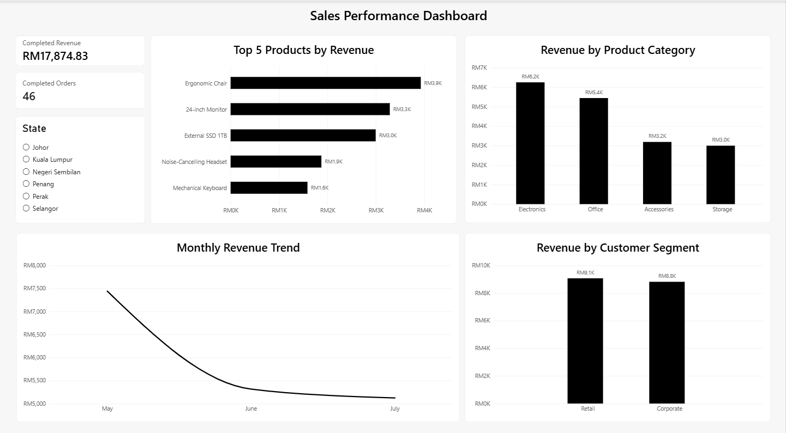

# SQL & Power BI Sales Analysis

A portfolio project demonstrating SQL querying, data analysis, relational data modeling, and Power BI dashboard development using a sales dataset.

## Project Overview

The project analyzes sales transactions across customers, products, and orders. SQL was used to explore and summarize the data, while Power BI was used to create an interactive sales performance dashboard.

## Tools Used

- SQL
- SQLite / DB Browser for SQLite
- Power BI
- DAX

## Dataset

The project contains three related tables:

- `customers`
- `products`
- `orders`

Relationships:

- `customers.customer_id` → `orders.customer_id`
- `products.product_id` → `orders.product_id`

## SQL Analysis

The SQL analysis includes:

1. Product price overview
2. Products priced above RM200
3. Top 5 most expensive products
4. Completed orders with customer names
5. Order count by status
6. Total quantity sold by product
7. Average product price by category
8. Revenue by product after discount
9. Customers with more than 3 completed orders
10. Revenue by customer segment

View the SQL queries here:

[`sales_analysis.sql`](sales_analysis.sql)

## Power BI Dashboard

The dashboard includes:

- Completed Revenue
- Completed Orders
- Top 5 Products by Revenue
- Revenue by Product Category
- Revenue by Customer Segment
- Monthly Revenue Trend
- Interactive State slicer

## Key Findings

- Completed revenue totaled **RM17,874.83**
- There were **46 completed orders**
- Electronics generated the highest revenue among product categories
- Retail and Corporate customer segments contributed similar levels of revenue
- Monthly completed revenue declined from May to July

## Portfolio

[View Full SQL & Power BI Portfolio](Insyirah_Hisham_SQL_PowerBI_Portfolio.pdf)
